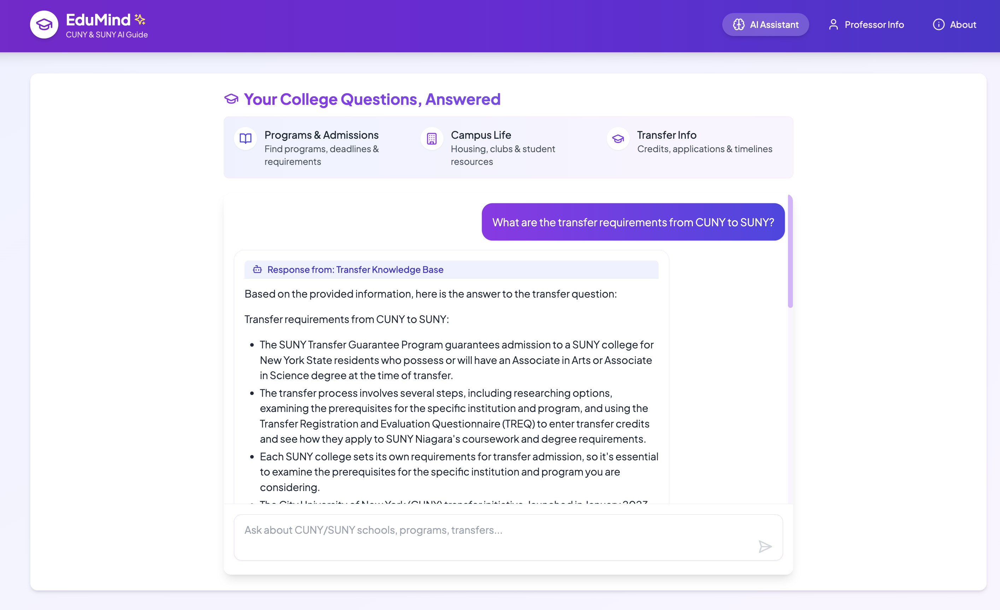

# CampusMind-CUNY-SUNY-AI-Agent-Backend-APIS

This is a FastAPI-based API'S for the CampusMind-CUNY-SUNY-AI-Agent, a specialized chatbot that provides information about CUNY and SUNY colleges, including details about transfers, professors, recommendations, and general information.

👉 **[Try the live demo](https://edumind-cuny-suny-ai-agent.vercel.app/)**



## 🎯 The Problem We're Solving

Students in New York face several challenges when navigating the CUNY and SUNY systems:

- **Scattered Information**: Details about professors and courses are spread across multiple platforms
- **Outdated Data**: Official websites often contain outdated or incomplete professor information
- **Time-Consuming Research**: Students waste hours trying to find reliable professor reviews and course details
- **Decision Paralysis**: With so many options across 60+ campuses, students struggle to make informed decisions

This AI-powered solution brings all this information together in one place, providing students with reliable, up-to-date information they can trust.

## 🧠 API Architecture

The CUNY/SUNY AI Assistant API is built with a focus on performance, scalability, and responsible AI design:

- **Multi-Agent System**: Specialized AI agents for different types of queries:
  - Transfer Agent: Handles transfer-related queries between institutions
  - Professor Agent: Provides information about professors, courses, and ratings
  - Recommendation Agent: Offers school recommendations based on student interests
  - Browser Agent: General information retrieval for queries that don't fit other categories

- **Retrieval Augmented Generation (RAG)**: 
  - Knowledge base built from official CUNY/SUNY documentation
  - FAISS vector store for semantic search
  - DuckDuckGo integration for real-time web search
  - MongoDB integration for structured professor and school data

- **LLM Provider Management**:
  - Load-balanced across multiple LLM providers (Groq, Cerebras, Together AI)
  - Fallback mechanisms for API reliability
  - Metadata tracking for model usage and attribution

- **Responsible AI**:
  - Content safety filtering for both queries and responses
  - Comprehensive policy enforcement
  - Source attribution for all information
  - Clear metadata about model usage

## 🚀 Technical Stack

### Backend Framework
- **FastAPI**: High-performance API with automatic OpenAPI documentation
- **Uvicorn**: ASGI server for production deployment
- **Pydantic**: For data validation and schema management

### AI & Machine Learning
- **LangChain & LangGraph**: For agent orchestration and workflow
- **FAISS**: Vector database for similarity search
- **HuggingFace Embeddings**: For semantic understanding
- **Multiple LLM Providers**:
  - Groq (llama-3.1-8b-instant)
  - Cerebras (llama-4-scout-17b-16e-instruct)
  - Together AI (meta-llama/Llama-3-8b-chat-hf)

### Data Storage & Retrieval
- **MongoDB**: For professor and school information
- **FAISS Vector Store**: For document embeddings
- **PDF Processing**: Extract information from handbooks and official documents

### Monitoring & Operations
- **Opik/Comet**: For LLM usage tracking and monitoring
- **Docker**: Containerization for deployment
- **Hugging Face Spaces**: Hosting platform

## 📦 API Documentation

The API provides two main endpoints:

### 1. General Query Endpoint

**Endpoint:** `POST /query`

**Request:**
```json
{
  "query": "What are the transfer requirements from CUNY to SUNY?",
  "user_id": "optional-tracking-id"
}
```

**Response:**
```json
{
  "agent_type": "transfer",
  "response": "The AI-generated text response about transfer requirements...",
  "sources": {
    "knowledge_base": [{
      "content": "...",
      "metadata": {
        "source": "StudentHandbook.pdf",
        "page": 42
      }
    }],
    "search": [{
      "source": "DuckDuckGo",
      "content": "..."
    }]
  },
  "original_query": "What are the transfer requirements from CUNY to SUNY?",
  "system_metadata": {
    "model_used": "llama-3.1-8b-instant",
    "provider": "groq",
    "embedding_model": "sentence-transformers/all-mpnet-base-v2",
    "timestamp": "2023-10-15T14:25:33.123Z"
  }
}
```

### 2. Professor-Specific Query Endpoint

**Endpoint:** `POST /professor`

**Request:**
```json
{
  "first_name": "John",
  "last_name": "Smith",
  "college_name": "SUNY Albany",
  "question": "What courses does he teach?",
  "user_id": "optional-tracking-id"
}
```

**Response:**
```json
{
  "agent_type": "professor",
  "response": "Professor John Smith at SUNY Albany teaches the following courses...",
  "sources": {
    "professor_db": {
      "professor_info": {
        "name": "John Smith",
        "school": "SUNY Albany",
        "department": "Computer Science",
        "courses": ["CS101", "CS202", "Advanced Algorithms"],
        "rating": 4.5
      },
      "reviews": [
        {
          "rating": 5,
          "date": "Spring 2023",
          "comment": "Excellent professor, very clear explanations",
          "course": "CS101"
        }
      ]
    },
    "knowledge_base": [...],
    "search": [...]
  },
  "original_query": "What courses does Professor John Smith at SUNY Albany teach?",
  "system_metadata": {
    "model_used": "llama-3.1-8b-instant",
    "provider": "groq",
    "embedding_model": "sentence-transformers/all-mpnet-base-v2",
    "timestamp": "2023-10-15T14:26:45.789Z"
  }
}
```

## 🐳 Docker Deployment

The API is containerized using Docker for easy deployment and scalability.

### Dockerfile

```dockerfile
FROM python:3.10-slim

WORKDIR /app

# Install dependencies
COPY requirements.txt .
RUN pip install --no-cache-dir -r requirements.txt

# Copy application code
COPY ./app /app/app

# Make port 7860 available (Hugging Face Spaces default port)
EXPOSE 7860

# Run the application with Uvicorn
CMD ["uvicorn", "app.main:app", "--host", "0.0.0.0", "--port", "7860"]
```

### Environment Variables

The API requires several environment variables to be set:

- `MONGO_URI`: MongoDB connection string
- `GROQ_API_KEY`: API key for Groq LLM service
- `TOGETHER_API_KEY`: API key for Together AI service
- `CEREBRAS_API_KEY`: API key for Cerebras AI service
- `COMET_API_KEY`: API key for Comet.ml/Opik integration

### Local Development with Docker

1. Build the Docker image:
   ```bash
   docker build -t cuny-suny-ai-assistant .
   ```

2. Run the container with environment variables:
   ```bash
   docker run -p 8000:7860 \
     -e MONGO_URI=your_mongo_uri \
     -e GROQ_API_KEY=your_groq_key \
     -e TOGETHER_API_KEY=your_together_key \
     -e CEREBRAS_API_KEY=your_cerebras_key \
     cuny-suny-ai-assistant
   ```

3. Access the API at `http://localhost:8000/docs`

## 🚀 Hugging Face Spaces Deployment

This API is deployed on Hugging Face Spaces, which provides a scalable environment for AI applications.

### Deployment Configuration

The `README.md` in the Hugging Face Space repository includes the following front-matter configuration:

```yaml
---
title: CUNY/SUNY AI Assistant
emoji: 🎓
colorFrom: blue
colorTo: indigo
sdk: docker
pinned: false
---
```

### Secrets Management

API keys and connection strings are stored as **Repository Secrets** in the Hugging Face Space settings:

1. Navigate to your Space settings
2. Click on "Repository secrets"
3. Add each required environment variable

⚠️ **IMPORTANT**: Never commit API keys directly in your code or Dockerfile.

## 🛡️ Responsible AI Implementation

### Content Safety

The system includes a comprehensive content safety filter that:

1. **Pre-checks queries** for policy violations before processing
2. **Post-checks responses** to ensure outputs conform to safety guidelines
3. **Returns safe alternatives** when responses might violate policies

### Custom Policy Implementation

The content safety filter uses a detailed policy (defined in `app/policies.py`) that covers:

- **O1: Illegal or harmful activities**: Preventing generation of content related to illegal activities, violence, etc.
- **O2: Child safety**: Protecting minors by filtering inappropriate content
- **O3: Privacy and personal data**: Refusing to provide non-public personal data
- **O4: Political and societal content**: Maintaining neutrality on controversial topics
- **O5: Financial and legal advice**: Disclaiming professional financial or legal advice
- **O6: cation-specific concerns**: Special considerations for the cation domain

### Source Attribution

All information provided includes source attributions:

- **Knowledge base sources**: Document name and page number
- **Web search results**: Search provider and snippet
- **Database information**: Data origin with timestamps
- **Model metadata**: Clear indication of which AI model generated the response

## 🔧 Getting Started

### Prerequisites

- Python 3.8+
- MongoDB instance
- API keys for LLM providers (Groq, Together AI, Cerebras)
- PDF files for knowledge base (student handbooks)

### Local Development

1. Clone the repository:
   ```bash
   https://github.com/slfagrouche/CampusMind-Backend.git
   cd CampusMind-Backend
   ```

2. Create a virtual environment:
   ```bash
   python -m venv venv
   source venv/bin/activate  # On Windows: venv\Scripts\activate
   ```

3. Install dependencies:
   ```bash
   pip install -r requirements.txt
   ```

4. Create a `.env` file with your environment variables:
   ```
   MONGO_URI=your_mongo_uri
   GROQ_API_KEY=your_groq_key
   TOGETHER_API_KEY=your_together_key
   CEREBRAS_API_KEY=your_cerebras_key
   COMET_API_KEY=your_comet_key
   ```

5. Run the development server:
   ```bash
   uvicorn app.main:app --reload
   ```

6. Access the API documentation at `http://localhost:8000/docs`

## 📈 Future Enhancements

- **Enhanced Personalization**: Tailoring recommendations based on user preferences and history
- **Expanded Database**: Adding more professors and courses from additional CUNY/SUNY campuses
- **Improved RAG**: Expanding the knowledge base with more official documents
- **Multi-language Support**: Adding support for languages commonly spoken in NY
- **Mobile App Integration**: Dedicated mobile apps for iOS and Android

## 🔗 Related Projects

### Frontend Repository
The frontend for this project is available at [slfagrouche/CampusMind-CUNY-SUNY-AI-Agent](https://github.com/slfagrouche/CampusMind-Frontend).

Features include:
- Modern React interface with TypeScript
- Tailwind CSS for responsive design
- Professor search functionality
- Chat interface for general queries
- Source attribution display

## 📝 License

This project is licensed under the MIT License. See the [LICENSE](LICENSE) file for details.

## 🤝 Contributing

Contributions are welcome! Please feel free to submit a Pull Request.

1. Fork the repository
2. Create your feature branch (`git checkout -b feature/amazing-feature`)
3. Commit your changes (`git commit -m 'Add some amazing feature'`)
4. Push to the branch (`git push origin feature/amazing-feature`)
5. Open a Pull Request

## 📬 Contact

Have questions or feedback? Reach out via:
- GitHub Issues 
- Email: SaidLfagrouche@gmail.com

---
